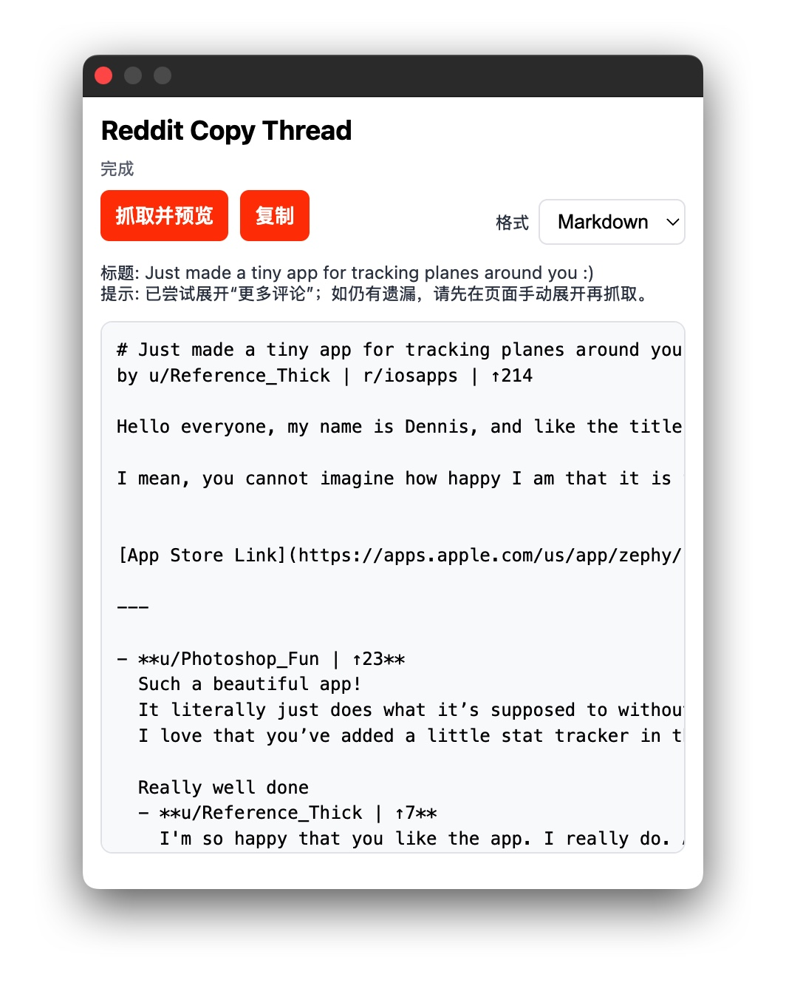

# Reddit Copy Thread

[English](README.md) | [简体中文](README.zh-CN.md)



一款 Chrome MV3 扩展，用于一键复制 Reddit 帖子及其「嵌套评论树」到剪贴板。支持导出 Markdown、纯文本 和 JSON。全本地运行，权限最小化。

## 功能特性
- 一键弹窗：抓取并预览 → 复制
- 重建嵌套评论树，尝试展开一轮 `more`
- 输出格式：Markdown、纯文本、JSON
- 无服务器依赖，所有逻辑本地执行
- 最小权限

## 安装（开发者模式）
方法 A（推荐，免解压）
1) 前往 GitHub → Releases 下载 `reddit-copy-threadv-<版本号>.zip`（例如 `reddit-copy-threadv-0.2.0.zip`，不要选择“Source code”包）。
2) 打开 Chrome → `chrome://extensions`，开启「开发者模式」。
3) 直接把这个 ZIP 拖拽到扩展页面，Chrome 会自动加载。

方法 B（解压加载）
1) 解压 ZIP 得到 7 个文件：`manifest.json`、`popup.html/js/css`、`icon16/48/128.png`。
2) 放入一个文件夹（例如 `reddit-copy-thread/`）。
3) 在 `chrome://extensions` 点击「加载已解压的扩展程序」，选择该文件夹。
4) 打开任意 Reddit 帖子，点击工具栏图标。

提示：如果解压工具报错，试试系统自带 unzip，例如：
`unzip reddit-copy-threadv-0.2.0.zip`

## 使用方法
- 点击「抓取并预览」构建评论树。
- 选择导出格式：Markdown / 纯文本 / JSON。
- 点击「复制」即可复制到剪贴板。

## 隐私
- 不会向任何服务器发送数据。
- 所有处理均在浏览器本地完成。

## 文件列表
```
manifest.json
popup.html
popup.js
popup.css
icon16.png, icon48.png, icon128.png
```

## 许可证
[MIT](./LICENSE)

_最后更新：2025-11-13_
